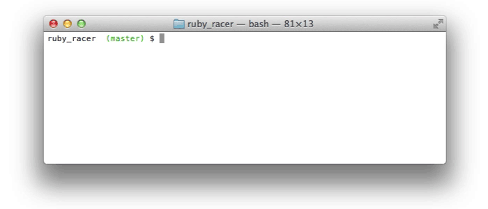

# Ruby Racer

## Summary
  
*Figure 1*.  A game of *Ruby Racer*.

We're going to build a simple game called *Ruby Racer*. This is a game where you just roll the die and move forward.

Initially, the game will be a race between two players.  Both players start at the beginning of the track, side-by-side.  Players take turns rolling a die and advancing along the track until one of them reaches the end of the track and wins the game.  (See Figure 1.)

Some challenges in building our game will be:

(1) determining appropriate management of state of the game (e.g., keeping track of player positions) 

(2) transforming data from one structure to another (e.g. transforming the game data into a printable board)

(3) ATTENTION TO DETAIL! ATTENTION TO DETAIL! ATTENTION TO DETAIL!

### Code Base
In this exercise, we're going to begin with some provided code. 

We have a few helper methods in the helper code section. Do not edit anything in the helper code section throughout this exercise.

We also have the driver code section. This code provides a basic outline for running a game of Ruby Racer.  It calls some methods, which we'll need to write.  For each of these methods, an empty method definition and comments about what it should do are provided above. You may not edit the driver code for Part 1.

Read through the driver code, and pay attention to the style, what methods exist, what their inputs and return values are, and how they segment the actions necessary to play the game.

## Objective 
### Part 1: Complete the Game
We need to create a working version of the game.  This will involve filling out the empty method definitions.

There is an empty method definition for each method called in the driver code, but that doesn't mean those are all the methods we should have.  Remember, we want to write methods that do one thing.

*Note:* Do not edit the driver code and the helper code

### Part 2: Adding More Players
Why limit the game to two players always labeled `a` and `b`?  Let's allow any number of players to sign up for a race!

~~~~ 
How many players?
> 5
Enter Player 1's name
> Andy
Enter Player 2's name
> Timmy
...
Enter Player 5's name
> Jeremy
And the race begins!
~~~~ 

Use the first two letters of their names (Andy -> An) as their symbol.

As you now have multiple players, add a ranking table for the players and their symbols at the bottom. After every turn, update the ranking.

~~~~ 
1st: Andy (An)
2nd: Jeremy (Je)
...
5th: Max (Ma)
~~~~ 

*Note:*  If we need to, we can edit the driver code for Part 2. Do not edit the helper code.